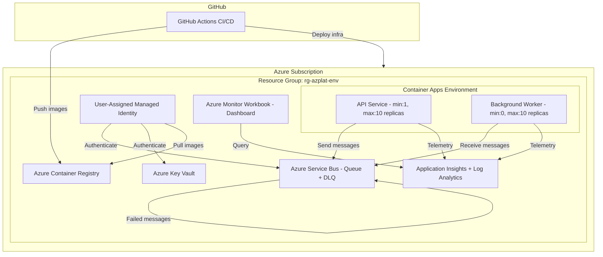

# Azure Platform Service

## Table of Contents

- [Use Case](#use-case)
- [How It Works](#how-it-works)
- [Infrastructure Architecture](#infrastructure-architecture)
- [Azure Components](#azure-components)
- [Prerequisites for Deployment](#prerequisites-for-deployment)
- [Secrets and Environment Variables](#secrets-and-environment-variables)
- [Deployment Guide](#deployment-guide)
- [Pipeline Architecture](#pipeline-architecture)
- [Pipeline Requirements](#pipeline-requirements)
- [Local Development](#local-development)
- [API Endpoints](#api-endpoints)
- [Design Decisions](#design-decisions)

---

## Use Case

This is a **cloud-native work item processing platform** built on Azure. It demonstrates a production-grade implementation of:

- A containerized REST API that accepts work items for asynchronous processing
- A background worker that dequeues and processes work items from a message queue
- Infrastructure as Code for reproducible, multi-environment deployments
- Automated CI/CD with zero-downtime deployment strategies (blue/green and canary)
- End-to-end observability with distributed tracing
- Zero-trust security with Managed Identity (no secrets in code)

**Business scenario:** An API consumer submits work items via HTTP. The system enqueues them for reliable asynchronous processing, provides retrieval of processed results, and scales automatically based on queue depth.

---

## How It Works

```
┌──────────────┐     POST /api/work     ┌──────────────────┐     Enqueue     ┌─────────────────┐
│  API Consumer │ ───────────────────────► │   API Service    │ ───────────────► │  Service Bus    │
└──────────────┘                         │  (.NET 8 Web API) │                 │  (Queue)        │
                                         └──────────────────┘                 └────────┬────────┘
┌──────────────┐     GET /api/work      ┌──────────────────┐                          │
│  API Consumer │ ◄──────────────────────│   API Service    │                   Dequeue │
└──────────────┘                         └──────────────────┘                          │
                                                                              ┌────────▼────────┐
                                                                              │ Background Worker │
                                                                              │ (.NET 8 Worker)  │
                                                                              └──────────────────┘
```

1. **Client submits work** → `POST /api/work` with a JSON payload
2. **API validates and enqueues** → Message placed on Azure Service Bus queue (with W3C trace context)
3. **Worker dequeues and processes** → Extracts trace context, processes item, stores result
4. **Client retrieves results** → `GET /api/work` returns processed items (most recent first, max 100)
5. **Failures are handled gracefully** → Transient errors retry with exponential backoff (2s, 4s, 8s); non-transient errors dead-letter immediately

---

## Infrastructure Architecture



---

## Azure Components

| Component | Resource Type | Purpose | SKU (Dev/Prod) |
|-----------|--------------|---------|----------------|
| **Container Apps Environment** | `Microsoft.App/managedEnvironments` | Hosts API and Worker containers with auto-scaling | Consumption |
| **API Container App** | `Microsoft.App/containerApps` | REST API (health probes, work submission/retrieval) | min:1 max:10 replicas |
| **Worker Container App** | `Microsoft.App/containerApps` | Background message processor | min:0 max:10 replicas |
| **Service Bus** | `Microsoft.ServiceBus/namespaces` | Message queue for async work items + Dead Letter Queue | Basic / Premium |
| **Container Registry** | `Microsoft.ContainerRegistry/registries` | Private Docker image storage | Basic / Standard |
| **Application Insights** | `Microsoft.Insights/components` | Telemetry, distributed tracing, alerting | Per-GB |
| **Log Analytics Workspace** | `Microsoft.OperationalInsights/workspaces` | Log storage and querying | Per-GB |
| **Key Vault** | `Microsoft.KeyVault/vaults` | Secure secret storage | Standard |
| **Managed Identity** | `Microsoft.ManagedIdentity/userAssignedIdentities` | Secretless auth to Azure services | N/A |
| **Monitor Workbook** | `Microsoft.Insights/workbooks` | Operational dashboard | N/A |
| **Alert Rule** | `Microsoft.Insights/scheduledQueryRules` | 5xx error rate > 5% alert | N/A |

### Scaling Rules

| Service | Trigger | Scale Up | Scale Down |
|---------|---------|----------|------------|
| API | CPU > 70% OR concurrent HTTP > 100 | Up to 10 replicas | Min 1 replica |
| Worker | Queue depth > 10 messages (KEDA) | Up to 10 replicas | Scale to 0 after 5 min idle |

### Security (RBAC Role Assignments)

| Principal | Role | Scope |
|-----------|------|-------|
| Managed Identity | Azure Service Bus Data Sender | Service Bus Namespace |
| Managed Identity | Azure Service Bus Data Receiver | Service Bus Namespace |
| Managed Identity | Key Vault Secrets User | Key Vault |
| Pipeline Service Principal | Key Vault Secret Get | Key Vault |

---

## Prerequisites for Deployment

### Tooling

| Tool | Minimum Version | Install |
|------|-----------------|---------|
| Azure CLI | >= 2.50 | [Install](https://docs.microsoft.com/cli/azure/install-azure-cli) |
| Terraform | >= 1.5.0 | [Install](https://www.terraform.io/downloads) |
| Docker | >= 20.10 | [Install](https://docs.docker.com/get-docker/) |
| .NET SDK | 8.0 | [Install](https://dotnet.microsoft.com/download/dotnet/8.0) |
| Git | >= 2.30 | [Install](https://git-scm.com/) |

### Azure Requirements

1. **Azure Subscription** with Contributor access
2. **Azure AD permissions** to create service principals and federated credentials
3. **Resource providers registered:**
   - `Microsoft.App`
   - `Microsoft.ServiceBus`
   - `Microsoft.ContainerRegistry`
   - `Microsoft.Insights`
   - `Microsoft.KeyVault`
   - `Microsoft.ManagedIdentity`
   - `Microsoft.OperationalInsights`

### Terraform State Backend (One-Time Setup)

```bash
# Create resource group for Terraform state
az group create --name rg-terraform-state --location eastus2

# Create storage account
az storage account create \
  --name stterraformstate \
  --resource-group rg-terraform-state \
  --sku Standard_LRS \
  --encryption-services blob

# Create blob container
az storage container create \
  --name tfstate \
  --account-name stterraformstate
```

### Service Principal (One-Time Setup)

```bash
# Create service principal for CI/CD
az ad sp create-for-rbac \
  --name "sp-azplat-cicd" \
  --role Contributor \
  --scopes /subscriptions/<SUBSCRIPTION_ID>

# Note the output: appId, tenant, password

# Get the Object ID (needed for Terraform variable)
az ad sp show --id <APP_ID> --query id --output tsv

# Configure OIDC federated credentials for GitHub Actions
az ad app federated-credential create \
  --id <APP_OBJECT_ID> \
  --parameters '{
    "name": "github-main",
    "issuer": "https://token.actions.githubusercontent.com",
    "subject": "repo:<OWNER>/<REPO>:ref:refs/heads/main",
    "audiences": ["api://AzureADTokenExchange"]
  }'
```

---

## Secrets and Environment Variables

### GitHub Secrets (Required for CI/CD Pipelines)

| Secret Name | Description | Where to Get |
|-------------|-------------|--------------|
| `AZURE_CLIENT_ID` | Service Principal Application (Client) ID | `az ad sp show --id <SP_NAME> --query appId` |
| `AZURE_TENANT_ID` | Azure AD Tenant ID | `az account show --query tenantId` |
| `AZURE_SUBSCRIPTION_ID` | Target Azure Subscription ID | `az account show --query id` |
| `ACR_LOGIN_SERVER` | Container Registry login URL (e.g., `azplatacprod.azurecr.io`) | Terraform output or Azure Portal |
| `PIPELINE_SP_OBJECT_ID` | Service Principal Object ID for Key Vault access | `az ad sp show --id <APP_ID> --query id` |
| `TF_BACKEND_RESOURCE_GROUP` | Resource group containing Terraform state storage | `rg-terraform-state` |
| `TF_BACKEND_STORAGE_ACCOUNT` | Storage account name for Terraform state | `stterraformstate` |
| `APP_INSIGHTS_APP_ID` | Application Insights App ID (for canary monitoring) | Azure Portal → App Insights → API Access |
| `APP_INSIGHTS_API_KEY` | Application Insights API Key (for canary monitoring) | Azure Portal → App Insights → API Access |

### Terraform Variables

Set in `infra/environments/dev.tfvars` and `infra/environments/prod.tfvars`:

| Variable | Description | Dev Value | Prod Value |
|----------|-------------|-----------|------------|
| `environment_name` | Environment identifier | `dev` | `prod` |
| `resource_prefix` | Naming prefix for resources | `azplat` | `azplat` |
| `location` | Azure region | `eastus2` | `eastus2` |
| `service_bus_sku` | Service Bus tier | `Basic` | `Premium` |
| `acr_sku` | Container Registry tier | `Basic` | `Standard` |
| `max_worker_replicas` | Worker max scale | `3` | `10` |
| `max_api_replicas` | API max scale | `3` | `10` |
| `min_worker_replicas` | Worker min (0 = scale to zero) | `0` | `0` |
| `min_api_replicas` | API min (must be >= 1) | `1` | `1` |
| `pipeline_sp_object_id` | SP Object ID for Key Vault | Replace placeholder | Replace placeholder |

### Container Apps Environment Variables (Set by Terraform)

| Variable | Mapped Config | Value Source |
|----------|---------------|--------------|
| `ServiceBus__Namespace` | `ServiceBus:Namespace` | Terraform: Service Bus FQDN |
| `APPLICATIONINSIGHTS_CONNECTION_STRING` | `ApplicationInsights:ConnectionString` | Terraform: App Insights connection string |

---

## Deployment Guide

### Step 1: Clone Repository

```bash
git clone <repository-url>
cd azure-platform-service
```

### Step 2: Configure GitHub Secrets

Go to GitHub → Settings → Secrets and variables → Actions. Add all secrets listed above.

### Step 3: Deploy Infrastructure

```bash
cd infra

# Login to Azure
az login
az account set --subscription <SUBSCRIPTION_ID>

# Initialize Terraform
terraform init \
  -backend-config="resource_group_name=rg-terraform-state" \
  -backend-config="storage_account_name=stterraformstate" \
  -backend-config="container_name=tfstate" \
  -backend-config="key=azure-platform-service-dev.tfstate"

# Plan (review changes)
terraform plan -var-file=environments/dev.tfvars -out=dev.tfplan

# Apply
terraform apply dev.tfplan
```

### Step 4: Build and Push Images (First Time)

```bash
# Get ACR name from Terraform output
ACR_NAME=$(terraform output -raw acr_login_server)

# Login to ACR
az acr login --name $ACR_NAME

# Build and push
docker build --target api -t $ACR_NAME/api:latest -f Dockerfile .
docker build --target worker -t $ACR_NAME/worker:latest -f Dockerfile .
docker push $ACR_NAME/api:latest
docker push $ACR_NAME/worker:latest
```

### Step 5: Verify Deployment

```bash
# Get API URL from Terraform output
API_FQDN=$(terraform output -raw container_apps_fqdn)

# Test liveness
curl https://<API_APP_FQDN>/health/live
# → {"status":"Healthy"}

# Test readiness
curl https://<API_APP_FQDN>/health/ready
# → {"status":"Healthy","dependencies":[...]}

# Submit a work item
curl -X POST https://<API_APP_FQDN>/api/work \
  -H "Content-Type: application/json" \
  -d '{"payload":"hello-world"}'
# → 202 Accepted

# Retrieve processed items
curl https://<API_APP_FQDN>/api/work
# → [...processed items...]
```

---

## Pipeline Architecture

The CI/CD is split into **three independent GitHub Actions workflows**:

```
┌─────────────────────────────────────────────────────────────────────────┐
│                        PIPELINE ARCHITECTURE                            │
├─────────────────────────────────────────────────────────────────────────┤
│                                                                         │
│  ┌─────────────────────────────────────┐                                │
│  │  infra-deploy.yml                   │  Trigger: infra/** changes     │
│  │                                     │           or manual dispatch    │
│  │  ┌───────────────┐                  │                                │
│  │  │ terraform-plan │──► Format check  │                                │
│  │  │               │──► Init          │                                │
│  │  │               │──► Validate      │                                │
│  │  │               │──► Plan          │                                │
│  │  └───────┬───────┘                  │                                │
│  │          │                          │                                │
│  │  ┌───────▼────────┐                 │                                │
│  │  │ terraform-apply │──► Apply        │                                │
│  │  │                │──► Export outputs │                                │
│  │  └────────────────┘                 │                                │
│  └─────────────────────────────────────┘                                │
│                                                                         │
│  ┌─────────────────────────────────────┐                                │
│  │  app-deploy.yml                     │  Trigger: app code changes     │
│  │                                     │           or manual dispatch    │
│  │  ┌──────────────┐                   │                                │
│  │  │ build-and-test│──► Restore       │                                │
│  │  │              │──► Build          │                                │
│  │  │              │──► Test           │                                │
│  │  └──────┬───────┘                   │                                │
│  │         │                           │                                │
│  │  ┌──────▼──────────┐                │                                │
│  │  │ build-push-image │──► Docker build│                                │
│  │  │                 │──► Push to ACR │                                │
│  │  └──────┬──────────┘                │                                │
│  │         │                           │                                │
│  │  ┌──────▼──────┐                    │                                │
│  │  │  deploy-app  │──► New revision 0%│                                │
│  │  │  (Blue/Green)│──► Health check   │                                │
│  │  │             │──► Shift traffic   │                                │
│  │  │             │──► OR Rollback     │                                │
│  │  └─────────────┘                    │                                │
│  └─────────────────────────────────────┘                                │
│                                                                         │
│  ┌─────────────────────────────────────┐                                │
│  │  canary-deploy.yml                  │  Trigger: manual only          │
│  │                                     │                                │
│  │  ┌──────────────────┐               │                                │
│  │  │ canary-deploy     │──► Deploy 10% │                                │
│  │  │                  │──► Monitor    │                                │
│  │  │                  │──► Promote OR │                                │
│  │  │                  │   Rollback    │                                │
│  │  └──────────────────┘               │                                │
│  └─────────────────────────────────────┘                                │
└─────────────────────────────────────────────────────────────────────────┘
```

### Pipeline 1: Infrastructure Deployment (`infra-deploy.yml`)

| Aspect | Detail |
|--------|--------|
| **Trigger** | Push to `main` (paths: `infra/**`), PR to `main` (paths: `infra/**`), or manual `workflow_dispatch` |
| **What it does** | Runs `terraform fmt`, `init`, `validate`, `plan`, and `apply` |
| **Environment selection** | Manual dispatch: user picks dev/prod. Push: main = prod |
| **On PR** | Runs plan only, comments plan summary on the PR |
| **On push/dispatch** | Runs plan + apply |
| **Auth** | OIDC federated credentials (no stored secrets) |
| **State** | Remote state in Azure Blob Storage (separate key per environment) |

### Pipeline 2: Application Build & Deploy (`app-deploy.yml`)

| Aspect | Detail |
|--------|--------|
| **Trigger** | Push to `main` (paths-ignore: `infra/**`, `*.md`), or manual `workflow_dispatch` |
| **Stage 1: Build & Test** | `dotnet restore` → `build` → `test`. Halts on failure. |
| **Stage 2: Image Push** | Builds API + Worker Docker images tagged with commit SHA, pushes to ACR. Timeout: 10 min. |
| **Stage 3: Blue/Green Deploy** | Deploys new revision at 0% traffic → validates readiness (3× HTTP 200 at 10s intervals) → shifts 100% on success |
| **Rollback** | On health check failure: retains previous revision at 100%, deactivates failed revision, creates GitHub issue |
| **Auth** | OIDC federated credentials |

### Pipeline 3: Canary Deployment (`canary-deploy.yml`)

| Aspect | Detail |
|--------|--------|
| **Trigger** | Manual `workflow_dispatch` only (inputs: environment, image_tag) |
| **Traffic split** | 10% canary, 90% stable |
| **Monitoring** | Error rate + p95 latency checked every 30 seconds |
| **Rollback condition** | Error rate > 5% over 3-minute window (minimum 50 requests) |
| **Promote condition** | Error rate < 5% AND p95 ≤ 2× stable for 10 continuous minutes |
| **Low traffic** | Extends evaluation until minimum 50 requests threshold is met |
| **Notifications** | Creates GitHub issue on rollback |

---

## Pipeline Requirements

### To run the Infrastructure Pipeline:

1. GitHub secrets configured: `AZURE_CLIENT_ID`, `AZURE_TENANT_ID`, `AZURE_SUBSCRIPTION_ID`, `PIPELINE_SP_OBJECT_ID`, `TF_BACKEND_RESOURCE_GROUP`, `TF_BACKEND_STORAGE_ACCOUNT`
2. Terraform state backend storage account exists
3. Service principal has Contributor access on the subscription
4. OIDC federated credential configured for the repository

### To run the Application Pipeline:

1. GitHub secrets configured: `AZURE_CLIENT_ID`, `AZURE_TENANT_ID`, `AZURE_SUBSCRIPTION_ID`, `ACR_LOGIN_SERVER`
2. Infrastructure already deployed (Container Apps, ACR exist)
3. Service principal has `AcrPush` role on the Container Registry
4. Managed Identity configured on Container Apps to pull from ACR

### To run the Canary Pipeline:

1. All Application Pipeline requirements
2. Additional secrets: `APP_INSIGHTS_APP_ID`, `APP_INSIGHTS_API_KEY`
3. Application already deployed (at least one stable revision running)

---

## Local Development

```bash
# Build
dotnet restore AzurePlatformService.sln
dotnet build AzurePlatformService.sln

# Run tests
dotnet test AzurePlatformService.sln

# Run API locally (health endpoints work without Service Bus)
dotnet run --project src/Api

# Run with Service Bus (set connection string in appsettings.Development.json)
# src/Api/appsettings.Development.json:
# { "ServiceBus": { "ConnectionString": "Endpoint=sb://..." } }
```

---

## API Endpoints

| Method | Path | Description | Response |
|--------|------|-------------|----------|
| GET | `/health/live` | Liveness probe | 200: `{"status":"Healthy"}` / 503: `{"status":"Unhealthy"}` |
| GET | `/health/ready` | Readiness probe (checks dependencies) | 200/503 with dependency details |
| POST | `/api/work` | Submit work item | 202 Accepted / 400 Bad Request / 503 Unavailable |
| GET | `/api/work` | Get processed items (max 100, newest first) | 200 with JSON array |

---

## Design Decisions

| Decision | Choice | Rationale |
|----------|--------|-----------|
| **IaC Tool** | Terraform | Multi-cloud skills, mature ecosystem, state management, modular composition |
| **Messaging** | Azure Service Bus | Enterprise-grade reliability, DLQ, KEDA integration, Managed Identity auth |
| **Identity** | User-Assigned Managed Identity | Zero secrets in code, automatic credential lifecycle, least-privilege RBAC |
| **Hosting** | Azure Container Apps | Serverless scaling, built-in revision management, KEDA triggers, cost-efficient |
| **Deployment** | Blue/Green + Canary | Zero-downtime releases, automatic rollback, risk mitigation with gradual traffic shift |
| **Observability** | OpenTelemetry + App Insights | Vendor-neutral instrumentation, end-to-end distributed tracing, native Azure integration |
| **Resilience** | Circuit Breaker + Retry + DLQ | Graceful degradation, no data loss, automatic recovery |
| **Pipeline Split** | Separate infra/app workflows | Independent lifecycle, infra changes don't rebuild app, faster feedback loops |

---

## Project Structure

```
.
├── .github/workflows/
│   ├── infra-deploy.yml        # Infrastructure pipeline (Terraform)
│   ├── app-deploy.yml          # Application pipeline (Build → Push → Blue/Green)
│   └── canary-deploy.yml       # Canary deployment (manual trigger)
├── infra/
│   ├── main.tf                 # Root module (orchestrates all modules)
│   ├── variables.tf            # Variable definitions
│   ├── outputs.tf              # Deployment outputs
│   ├── providers.tf            # azurerm provider config
│   ├── backend.tf              # Remote state backend
│   ├── environments/
│   │   ├── dev.tfvars          # Dev values
│   │   └── prod.tfvars         # Prod values
│   └── modules/
│       ├── app-insights/       # Application Insights + alerts
│       ├── container-apps-env/ # Container Apps + scaling rules
│       ├── container-registry/ # ACR
│       ├── dashboard/          # Azure Monitor Workbook
│       ├── key-vault/          # Key Vault + access policies
│       ├── managed-identity/   # Identity + RBAC roles
│       └── service-bus/        # Namespace + Queue + DLQ
├── src/
│   ├── Api/                    # ASP.NET Core 8 Web API
│   ├── Shared/                 # Common models and interfaces
│   └── Worker/                 # .NET 8 Background Worker
├── tests/                      # Unit + Property-based tests
├── Dockerfile                  # Multi-stage (API + Worker targets)
├── AzurePlatformService.sln    # Solution file
└── README.md                   # This file
```
